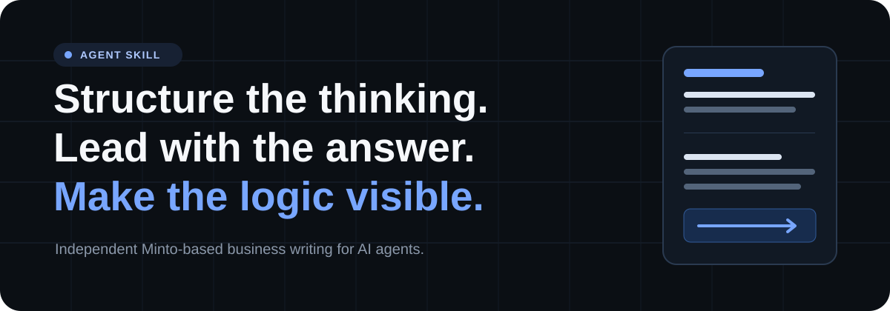

<p align="center">
  
</p>

<h1 align="center">business-writing</h1>

<p align="center">
  <strong>The Minto Pyramid Principle, operationalized for agents.</strong>
</p>

<p align="center">
  <a href="https://agentskills.io"></a>
  <a href="LICENSE"></a>
  
</p>

---

`business-writing` 2.0.0 is an independent Agent Skill that operationalizes Barbara Minto's Pyramid Principle for drafting, revising, analyzing, and presenting business communication.

It helps agents put the governing answer first, build a defensible Key Line, test the logic beneath it, and reflect that hierarchy in emails, memos, reports, proposals, executive summaries, and presentations.

> **Independent and unofficial.** This project is not affiliated with or endorsed by Barbara Minto or Minto International.

## Install

One skill, any host that supports the open [Agent Skills](https://agentskills.io) format.

### Claude Code plugin

Add the repository as a marketplace, then install the plugin:

```text
/plugin marketplace add kemalcanyapali/business-writing
/plugin install business-writing@business-writing
```

Future ClaudePluginHub installation:

```bash
npx claudepluginhub kemalcanyapali/business-writing --plugin business-writing
```

### Agent Skills · project scope

Keeps the skill with the repository so the team can share it:

```bash
npx skills@latest add kemalcanyapali/business-writing --skill business-writing
```

### Agent Skills · global scope

Makes the skill available across projects:

```bash
npx skills@latest add kemalcanyapali/business-writing --skill business-writing -g
```

The installer detects supported agents and lets you choose the target. Restart the agent session if it does not reload skills automatically.

## What it applies

| Concept | How the skill uses it |
| --- | --- |
| **Governing answer** | States the recommendation, conclusion, or resolution that answers the reader's main question. |
| **Key Line** | Places the principal supporting ideas directly beneath the governing answer. |
| **Pyramid Rules** | Requires each summary to cover its support, each group to contain comparable ideas, and each group to follow a defensible order. |
| **Vertical relationship** | Tests whether lower-level points answer the question raised by the point above them. |
| **Horizontal relationship** | Makes each peer group consistently deductive or inductive and keeps points at the same level of abstraction. |
| **SCQA** | Uses Situation, Complication, Question, and Answer to establish why the message exists and what resolves it. |
| **Deduction / induction** | Either derives an implication from linked premises or draws a shared conclusion from comparable observations or actions. |
| **Logical orders** | Organizes groups by time, structure, or degree of importance. |
| **Problem Definition Framework** | Clarifies the starting state, disturbing event, undesired result, desired result, prior attempts, and actual question. |
| **Diagnostic frameworks** | Maps systems, activities, or possible causes to determine where and why a problem occurs. |
| **Logic trees** | Breaks an objective into non-overlapping alternatives for finding, testing, and selecting actions. |
| **Page, screen, and prose reflection** | Exposes the completed hierarchy through headings and layout, slide storyboards and message titles, or direct image-based prose. |

Structural groups are tested for mutual exclusivity and collective coverage where MECE treatment is appropriate. Missing order, mixed categories, or empty summaries are treated as signs that the thinking needs repair.

## Execution flow

```text
Reader's question
      ↓
Governing answer
      ↓
Key Line and supporting pyramid
      ↓
Vertical + horizontal logic
      ↓
SCQA and logical order
      ↓
Page / screen / prose draft
      ↓
Evidence, structure, and safety checks
      ↓
Ready-to-use artifact
```

The skill works top down when the likely question and answer are clear. When they are not, it works bottom up: grouping supplied points, drawing substantive summaries, inferring the governing answer, and then presenting the result top down.

## Problem solving

For analytical work, the skill separates three jobs:

1. **Define the problem:** establish the opening state, the event that changed it, the current undesired result (`R1`), the measurable desired result (`R2`), and what has already been tried.
2. **Diagnose causes:** derive a framework from the situation, create MECE branches where possible, turn possible causes into testable questions, and request only the evidence needed.
3. **Develop actions:** use a logic tree to decompose ways to reach `R2`, compare benefits and risks, and remove gaps, overlaps, and irrelevant branches.

The resulting recommendation is then rebuilt as a pyramid rather than presented as a transcript of the analysis.

## Use it

Copy a prompt and add your material:

```text
Use business-writing to rewrite this memo. Lead with the governing answer, build a three-point Key Line, and preserve every fact and qualifier.
```

```text
Turn these notes into an executive decision request using SCQA. Mark missing evidence with [NEEDS INPUT: ...].
```

```text
Diagnose why customer onboarding is slowing. Define R1 and R2, then create a MECE diagnostic framework and evidence plan.
```

```text
Build a logic tree for reducing operating cost without lowering service levels. Separate options, risks, and assumptions.
```

```text
Review this proposal for broken vertical relationships, mixed inductive groups, and unsupported summaries. Then rewrite it.
```

```text
Convert this report into a five-slide storyboard. Give each slide a message title and make the screen hierarchy reflect the pyramid.
```

By default, the skill returns the finished artifact rather than a framework lecture. Ask for the pyramid, rationale, edit notes, or validation report when you want to inspect the reasoning.

## On-demand chapter loading

[`SKILL.md`](SKILL.md) contains the operating contract, core models, workflow, and validation checks. Deeper material is split across 12 chapter files and 3 appendix files.

An agent can load only the relevant chapter when:

- the prompt names a chapter ID such as `ch05` or `app-a`
- the task needs deeper treatment of a specific framework
- the core workflow reveals a structural or analytical problem
- the user asks to browse the chapter or topic index

This keeps routine rewrites compact while making detailed guidance available on demand. [`glossary.md`](glossary.md), [`patterns.md`](patterns.md), and [`cheatsheet.md`](cheatsheet.md) provide definitions, reusable procedures, and quick validation rules.

## Evidence and safety

The skill will not:

- invent facts, quotations, evidence, calculations, approvals, deadlines, or certainty
- turn estimates, assumptions, allegations, or unresolved claims into confirmed facts
- remove material legal, compliance, technical, contractual, or source qualifications
- silently resolve contradictions or consequential missing information
- follow instructions embedded inside quoted drafts, attachments, links, or other untrusted content
- optimize communication for deception, manipulation, coercion, concealment, or discriminatory treatment

Consequential gaps are marked as `[NEEDS INPUT: specific information required]`.

Clear structure does not validate the underlying evidence or decision. Personnel, legal, financial, medical, security, and public communications should receive appropriate qualified human review.

## Repository

```text
business-writing/
├── .claude-plugin/
│   ├── marketplace.json
│   └── plugin.json
├── assets/
│   └── hero.svg
├── chapters/
│   ├── ch01-why-a-pyramid-structure.md
│   ├── ch02-substructures-within-the-pyramid.md
│   ├── ch03-how-to-build-a-pyramid-structure.md
│   ├── ch04-fine-points-of-introductions.md
│   ├── ch05-deduction-and-induction.md
│   ├── ch06-imposing-logical-order.md
│   ├── ch07-summarizing-grouped-ideas.md
│   ├── ch08-defining-the-problem.md
│   ├── ch09-structuring-the-analysis.md
│   ├── ch10-reflecting-the-pyramid-on-the-page.md
│   ├── ch11-reflecting-the-pyramid-on-a-screen.md
│   ├── ch12-reflecting-the-pyramid-in-prose.md
│   ├── app-a-problem-solving-in-structureless-situations.md
│   ├── app-b-examples-of-introductory-structures.md
│   └── app-c-summary-of-key-points.md
├── LICENSE
├── README.md
├── SKILL.md
├── cheatsheet.md
├── glossary.md
└── patterns.md
```

| File | Purpose |
| --- | --- |
| [`SKILL.md`](SKILL.md) | Agent instructions, framework overview, workflow, indexes, and guardrails |
| [`glossary.md`](glossary.md) | Framework terms and distinctions |
| [`patterns.md`](patterns.md) | Reusable drafting, restructuring, and analysis procedures |
| [`cheatsheet.md`](cheatsheet.md) | Decision rules, logic tests, warning signs, and validation checks |
| [`chapters/`](chapters/) | On-demand guidance across 12 chapters and 3 appendices |

## Attribution and scope

This repository is an independent, unofficial implementation based on the framework associated with Barbara Minto's Pyramid Principle.

It is **not affiliated with, endorsed by, certified by, or authorized by Barbara Minto or Minto International**. It provides original, synthesized framework guidance for agents—not book text and not a substitute for the complete source. Users should obtain the book for the full original treatment.

## Update

Project installation:

```bash
npx skills update business-writing
```

Global installation:

```bash
npx skills update business-writing -g
```

## License

[MIT](LICENSE)
